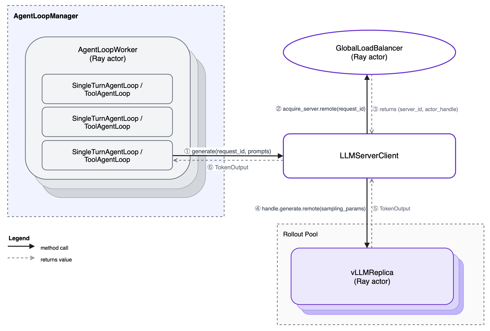
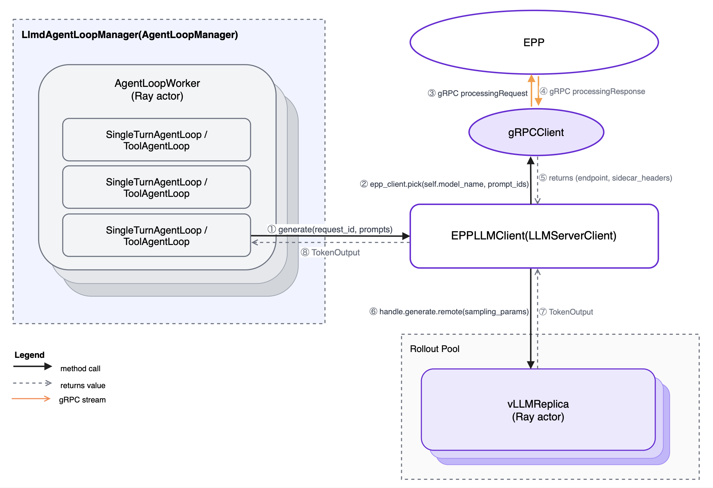

# llm-d RL verl Integration

This package integrates [llm-d](https://github.com/llm-d/llm-d)'s inference router into [verl](https://github.com/volcengine/verl) RL training rollouts. During each training step verl generates completions from a set of vLLM replicas; this integration replaces verl's default round-robin replica selection with llm-d's **Endpoint Picker Plugin (EPP)**, which routes each request to the replica most likely to have its KV cache already warm — reducing redundant computation and improving throughput in large-group RL workloads (GRPO, PPO with large rollout groups).

No verl source changes are required. Everything is wired in through Hydra config.

---

## When to use which integration

| | EPP router (Integration 1) | llm-d stack (Integration 2) |
|---|---|---|
| **How routing works** | verl workers call EPP over gRPC, get back a replica address, call that replica's Ray actor directly | verl workers HTTP POST to Envoy; Envoy calls EPP and forwards to the replica |
| **Extra processes** | EPP only | EPP + Envoy |
| **Best for** | Performance-critical runs; fewer moving parts | Closer to a production llm-d deployment; full HTTP stack |
| **PD disaggregation** | ✓ | ✓ |

If you are unsure, **start with Integration 1 (EPP router)** — it is simpler and has lower latency.

---

## How it works

During each training step, verl drives generation through the following component hierarchy:



`LLMServerClient` is the object `AgentLoopWorker` calls for every generation request. verl's default implementation uses `GlobalRequestLoadBalancer` to select replicas by least in-flight requests.

This integration replaces two components — wired in via a single Hydra key, no verl patches:

- **`AgentLoopManager`** — extended to start EPP (and optionally Envoy) as Ray actors pinned to the head node, and to inject a custom `LLMServerClient` into each `AgentLoopWorker`.
- **`LLMServerClient`** — replaced with `EPPLLMClient` (Integration 1) or `EnvoyLLMClient` (Integration 2), both of which route through EPP's scoring system.

---

## Integration 1 — EPP router (direct gRPC)

Each generation request is sent to EPP via gRPC ext_proc. EPP scores all available vLLM replicas (prefix-cache hit rate, queue depth, KV utilization) and returns the chosen backend address. `EPPLLMClient` then calls that replica's Ray actor directly — the same path as verl's built-in client, but with EPP-driven selection.



### Startup sequence

After all vLLM replicas are up:

1. `LlmdRouterAgentLoopManager` spawns `LlmdActor` — a Ray actor pinned to the head node.
2. `LlmdActor` writes the EPP endpoints YAML, starts the EPP subprocess, waits for its health port, and returns the gRPC address.
3. `LlmdRouterAgentLoopManager` builds `EPPLLMClient` with that address and replaces `self.llm_client` — workers receive it before any generation begins.

### Config keys

| Key | Required | Default | Description |
|-----|----------|---------|-------------|
| `rollout.agent.agent_loop_manager_class` | yes | — | `llm_d_rl_verl_integration.epp_router.agent_loop_manager.LlmdRouterAgentLoopManager` |
| `rollout.custom.epp_config_file` | yes | — | Path to EPP YAML config (plugin list, scorers). Use `deploy/epp-config.yaml` as a starting point. |
| `rollout.custom.epp_endpoints_file` | yes | — | Path where the endpoints YAML is written; must match the `path` in the EPP config's `file-discovery` plugin |
| `rollout.custom.epp_grpc_port` | no | `9002` | EPP gRPC ext_proc port |
| `rollout.custom.epp_grpc_health_port` | no | `9003` | EPP gRPC health check port |
| `rollout.custom.epp_pool_name` | no | `file-discovery` | EPP pool name |
| `rollout.custom.epp_pool_namespace` | no | `default` | EPP pool namespace |

Supports PD — see [PD Disaggregation](#pd-disaggregation).

---

## Integration 2 — llm-d stack (Envoy + EPP, HTTP proxy)

All generation requests are sent to a single **Envoy** proxy endpoint. Envoy calls EPP via gRPC ext_proc to pick the best replica, then forwards the request to it. verl workers only ever speak HTTP to one address; all routing intelligence lives inside Envoy + EPP on the head node.

### Startup sequence

After all vLLM replicas are up:

1. `LlmdAgentLoopManager` spawns `LlmdActor` on the head node.
2. `LlmdActor` writes the EPP endpoints YAML, starts EPP, starts Envoy, and returns `<head-node-ip>:8081`.
3. `LlmdAgentLoopManager` builds `EnvoyLLMClient` with that address.

### Config keys

| Key | Required | Default | Description |
|-----|----------|---------|-------------|
| `rollout.agent.agent_loop_manager_class` | yes | — | `llm_d_rl_verl_integration.llmd_stack.agent_loop_manager.LlmdAgentLoopManager` |
| `rollout.custom.epp_config_file` | yes | — | Path to EPP YAML config |
| `rollout.custom.epp_endpoints_file` | yes | — | Path where endpoints YAML is written |
| `rollout.custom.envoy_config` | yes | — | Path to Envoy config YAML. Use `deploy/envoy.yaml` (mounted from the `llmd-epp-configs` ConfigMap at `/etc/llmd-configs/envoy.yaml`). |
| `rollout.custom.envoy_port` | no | `8081` | Envoy listener port |
| `rollout.custom.epp_grpc_port` | no | `9002` | EPP gRPC ext_proc port |
| `rollout.custom.epp_grpc_health_port` | no | `9003` | EPP gRPC health check port |

For PD disaggregated mode see [PD Disaggregation](#pd-disaggregation).

---

## PD Disaggregation

Both integrations support prefill-decode (PD) disaggregation via `rollout.name=vllm-llmd-pd`.

Replicas are split into prefill and decode roles by `PDEngineReplicaFactory`. The first `prefill_replicas` ranks become prefill; the remaining become decode. `world_size / tp_size` must equal `prefill_replicas + decode_replicas`.

- **Prefill replicas** — launch vLLM with NIXL side-channel env vars. They never serve `generate()` calls directly; the decode sidecar pulls KV blocks from them.
- **Decode replicas** — launch vLLM with NIXL env vars, then spawn `llm-d-routing-sidecar` alongside. The sidecar is the public endpoint: it fetches the KV cache from the prefill replica over NIXL, then decodes locally.

Role labels (`llm-d.ai/role: prefill` / `decode`) are written to the EPP endpoints YAML so EPP's `prefill-filter` and `decode-filter` plugins route correctly.

### Config keys

| Key | Required | Description |
|-----|----------|-------------|
| `rollout.name` | yes | `vllm-llmd-pd` |
| `rollout.disaggregation.prefill_replicas` | yes | Number of prefill replicas |
| `rollout.disaggregation.decode_replicas` | yes | Number of decode replicas |
| `rollout.engine_kwargs.vllm.kv_transfer_config.kv_connector` | yes | `NixlConnector` |
| `rollout.engine_kwargs.vllm.kv_transfer_config.kv_role` | yes | `kv_both` |
| `rollout.custom.sidecar_connector` | no | KV connector type for `llm-d-routing-sidecar` (default: `nixlv2`) |
| `model.external_lib` | yes | `llm_d_rl_verl_integration.register_pd` — registers `vllm-llmd-pd` in FSDP worker processes |

Use `deploy/epp-config-pd.yaml` as the EPP config for PD runs.

---

## Observability

### Per-request JSONL logging

`EPPLLMClient` writes a JSONL timing record per request when `VERL_REQLOG_DIR` is set. The file is `$VERL_REQLOG_DIR/reqlog-<pid>.jsonl`, one file per worker process, line-buffered.

Fields: `ts, request_id, endpoint, prompt_hash, prompt_tokens, output_tokens, pick_s, gen_s`

`prompt_hash` is a BLAKE2b-8 digest of the token IDs — requests in the same GRPO group (same prompt, different samples) will share the same hash across replicas.

The logging is a no-op when `VERL_REQLOG_DIR` is unset, so it is safe to ship in all builds.

### Debug logging

All components default to quiet output. Increase verbosity with these env vars:

| Env var | Component | Debug value |
|---------|-----------|-------------|
| `VERL_VLLM_LOG_LEVEL` | vLLM inside replicas | `DEBUG` |
| `VERL_SIDECAR_LOG_LEVEL` | llm-d routing sidecar | `5` |
| `VERL_EPP_VERBOSITY` | EPP subprocess | `5` |
| `VERL_ENVOY_LOG_LEVEL` | Envoy proxy | `debug` |

Log files on the pod: `/tmp/epp.log`, `/tmp/envoy.log`, `/tmp/sidecar-decode-{rank}.log`.

*Note: Ray actors are spawned as new processes and do not inherit the launching shell's environment. Set these in the pod spec `env:` section (KubeRay) or in your `ray.init` runtime env.*

---

## Supplying the EPP and Envoy at runtime

Neither the EPP nor the Envoy binary is baked into the verl image (a ~28 GB build), so iterating on either never triggers a verl rebuild. `LlmdActor` launches whatever binaries `VERL_EPP_BINARY` (default `/usr/local/bin/epp`) and `VERL_ENVOY_BINARY` (default `/usr/local/bin/envoy`) point at.

Two ways to get the binaries onto the pod:

- **On pod start (cold path):** the `fetch-binaries` init container in `deploy/ray-cluster.yaml.tmpl` extracts `/app/epp` from a separate public EPP image and `/usr/local/bin/envoy` from a separate Envoy image (both set in `deploy/deploy.env`) into a shared `llm-d-bins` emptyDir. Bump the image tag in `deploy.env` and recreate the pod to change the EPP or Envoy version.
- **Into a running pod (fast inner loop, EPP only):** `scripts/utils/push-epp.sh` builds the EPP from a local checkout (or extracts it from an image with `--from-image REF`) and `kubectl cp`s it to `/opt/llm-d-bins/epp` — no verl rebuild, no pod recreation. Restart the training run to pick it up (EPP is started once per job).

Only the sidecar stays baked into the image; override its path at runtime via `VERL_SIDECAR_BINARY` if needed.

---

## Code structure

```
.
├── src/
│   └── llm_d_rl_verl_integration/       # Python package (pip install -e .)
│       ├── base_agent_loop_manager.py    # LlmdBaseAgentLoopManager — base for both integrations.
│       │                                 # Fetches server addresses, calls subclass hooks,
│       │                                 # replaces self.llm_client before workers start.
│       ├── llmd_actor.py                 # Ray actor pinned to the head node. Starts EPP and
│       │                                 # optionally Envoy as subprocesses, writes the
│       │                                 # endpoints YAML, returns service addresses.
│       ├── endpoints.py                  # Writes the EPP endpoints YAML from vLLM addresses.
│       ├── pd_replica.py                 # PD-aware vLLM server classes (prefill + decode).
│       ├── register_pd.py                # Registers vllm-llmd-pd in FSDP worker processes
│       │                                 # (imported via model.external_lib).
│       ├── epp_router/                   # Integration 1 — EPP direct gRPC routing
│       │   ├── agent_loop_manager.py     # LlmdRouterAgentLoopManager
│       │   ├── llm_client.py             # EPPLLMClient
│       │   └── grpc_client.py            # Async gRPC ext_proc client (hand-rolled protobuf)
│       └── llmd_stack/                   # Integration 2 — Envoy + EPP HTTP proxy routing
│           ├── agent_loop_manager.py     # LlmdAgentLoopManager
│           └── llm_client.py             # EnvoyLLMClient
│
├── deploy/                              # KubeRay deployment toolchain
│   ├── README.md                        # Deployment walkthrough with training script examples
│   ├── deploy.sh                        # Render ray-cluster.yaml.tmpl with deploy.env, create ConfigMap, apply/delete
│   ├── deploy.env                       # Single source of truth for the namespace and every runtime image
│   ├── ray-cluster.yaml.tmpl            # RayCluster manifest template (head + worker); values from deploy.env
│   ├── configmap.yaml                   # Reference stub; the ConfigMap is built by deploy.sh
│   ├── setting-kuberay.md               # KubeRay operator / CRD install instructions
│   ├── Dockerfile.verl-vllm018-llm-d-integration  # verl image build
│   ├── epp-config.yaml                  # EPP config — standard prefix-cache routing (source of truth)
│   ├── epp-config-pd.yaml               # EPP config — PD-aware routing (source of truth)
│   └── envoy.yaml                       # Envoy proxy config for the llm-d stack integration (source of truth)
│
├── scripts/
│   ├── run_test.sh                      # Unified run script: --mode native|epp|llm-d
│   │                                    # Wraps verl's run_qwen3_4b_fsdp.sh with the right Hydra overrides.
│   ├── utils/
│   │   └── push-epp.sh                  # Push a new EPP binary into the running head pod
│   │                                    # without a verl rebuild or pod recreation.
│   └── benchmarks/                      # Internal A/B experiment harness (not part of the package)
│       ├── README.md                    # Instrumentation runbook
│       ├── rl_orchestrate.sh            # Supervise a run to completion and collect artifacts
│       └── vllm_scrape.py               # Poll vLLM /metrics from every replica into a CSV
│
└── docs/
    └── diagrams/                        # Architecture call-flow diagrams
```

---

## How to run

See [deploy/README.md](deploy/README.md) for a step-by-step KubeRay deployment walkthrough, including manifests, EPP config setup, and training script examples for all four modes (EPP / Envoy × non-PD / PD).
